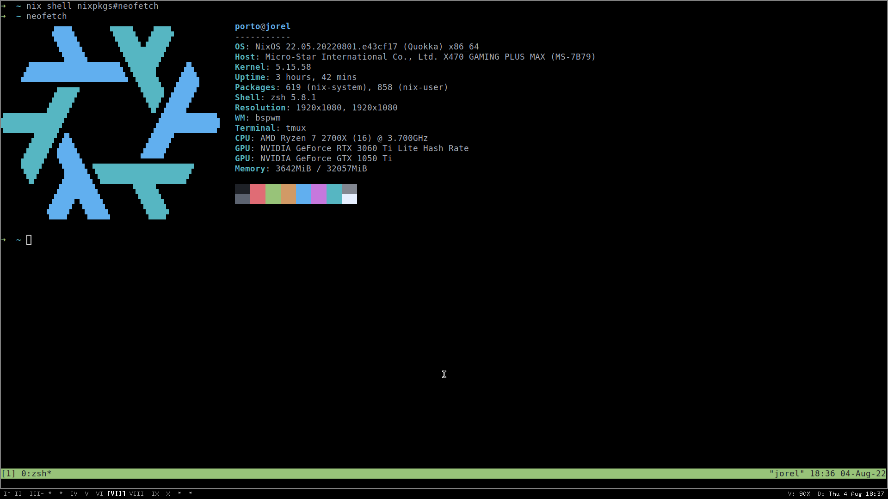

# dotfiles

It uses [home-manager](https://github.com/nix-community/home-manager) to install and create programs configurations based off the `home.nix` file.



[Home Manager Manual](https://nix-community.github.io/home-manager/)


### Debian + Nix as package manager(?)

For my non-nixos machines I'm currently using debian `apt` strictly for the base system, and Nix for all userspace apps.

### Usage

Make sure `nix` and `home-manager` is installed.

```
$ nix-channel --add https://github.com/nix-community/home-manager/archive/master.tar.gz home-manager
$ nix-channel --update
$ export NIX_PATH = "$HOME/.nix-defexpr/channels:/nix/var/nix/profiles/per-user/root/channels";
$ nix-shell '<home-manager>' -A install
```

Create a symbolic link of `./config/nixos/hosts/<host>/home.nix` at `$HOME/.config/nixpkgs/home.nix`.

```
$ ln home.nix $HOME/.config/nixpkgs/home/nix
```

Run `home-manager switch`

# Shell scripts

Handful collection of shell scripts inspired by https://github.com/salman-abedin/alfred


# FAQ

Home manager and flakes with Non-NixOS systems
- https://dee.underscore.world/blog/home-manager-flakes/
- https://gvolpe.com/blog/nix-flakes/
