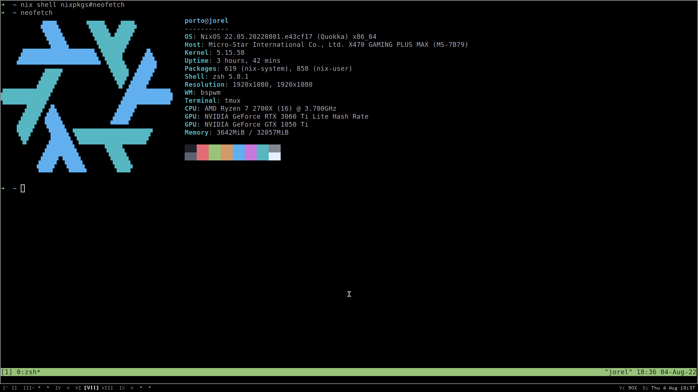

# dotfiles

One Nix flake for all my machines: macOS system config with
[nix-darwin](https://github.com/nix-darwin/nix-darwin), user config with
[home-manager](https://github.com/nix-community/home-manager), NixOS hosts,
and the homelab cluster manifests.



## Usage

```
$ ./setup [--update] [host]
```

`host` defaults to the machine's short hostname. `--update` bumps every flake
input first. The script picks the right tool for the host:

| Host | Kind | Applied with |
|-|-|-|
| boris | macOS, aarch64 | nix-darwin, with home-manager as a module |
| zaza | macOS, x86_64 | standalone home-manager |
| jorel, klong | Linux | standalone home-manager |

On a Mac, one run applies the system (Homebrew, macOS defaults, fonts, Touch
ID sudo) and the home-manager config together.

### New Mac

1. Install Nix with the [Determinate installer](https://determinate.systems/nix-installer/)
   (nix-darwin is configured with `nix.enable = false` to leave Nix to it).
2. Install [Homebrew](https://brew.sh).
3. Clone this repo to `~/www/portothree/dotfiles`.
4. Add `hosts/<host>/darwin.nix` and `profiles/<host>/home.nix` (copy boris),
   and a `darwinConfigurations.<host>` entry in `flake.nix`.
5. Run `./setup <host>`. It bootstraps nix-darwin on the first run and sets
   the machine's hostname, so later runs need no argument.

On the first switch, nix-darwin refuses to overwrite `/etc` files it doesn't
own (for example `/etc/zshrc` or `/etc/bashrc`); rename them to
`*.before-nix-darwin` as it asks. Files home-manager finds in `$HOME` are
moved aside with the same suffix.

Homebrew never uninstalls anything here (`onActivation.cleanup` stays
`"none"`), so packages missing from the list are left alone.

Apps installed by hand before they were added as casks make `brew bundle`
fail on the first switch. Hand them over to Homebrew once:

```
$ brew install --cask --adopt arduino-ide chatgpt claude jamie ledger-wallet \
    microsoft-teams notion notion-calendar obsidian openvpn-connect raycast \
    steam telegram vlc zed zen
```

App Store apps (`masApps`) need you to be signed in to the App Store.

### Not managed here

No Nix option or Homebrew cask covers these; install them by hand.

- Setapp (the `setapp` cask installs the client): CleanMyMac, CleanShot X,
  JoyCast, Lungo, Proxyman, TablePlus, TripMode, Tripsy
- Direct downloads: Delta (Zed), Intelbras SIMPlay, IBKR Desktop
- `npm -g`: `@google/gemini-cli` (nixpkgs lags far behind), and
  `ledger-reports`/`ynab-to-ledger` linked from the memex repo
- `cargo install`: `abtop`, `portogrrs`; `go install`: `aperture`
- `~/.local/bin`: `claude` and `basic-memory` from their own installers,
  `camo-studio`

## Host names

Machines are named after characters from the Brazilian animated series
[Irmão do Jorel](https://irmaodojorel.fandom.com/pt-br/wiki/Irm%C3%A3o_do_Jorel_Wiki).
New machines, VMs and test fixtures follow the same scheme, using a
character not taken yet from the [character list](https://irmaodojorel.fandom.com/pt-br/wiki/Categoria:Personagens).

| Host | Character | Machine |
|-|-|-|
| boris | [Bóris](https://irmaodojorel.fandom.com/pt-br/wiki/B%C3%B3ris) | MacBook Pro M3 (2023) |
| zaza | [Zazá](https://irmaodojorel.fandom.com/pt-br/wiki/Zaz%C3%A1) | MacBook Pro i5 (2020), work |
| jorel | [Jorel](https://irmaodojorel.fandom.com/pt-br/wiki/Jorel) | Main workstation, NixOS (`jorel-wsl`: WSL on it) |
| klong | [Klong](https://irmaodojorel.fandom.com/pt-br/wiki/Klong) | ThinkPad X1 Nano, NixOS |
| juju | [Vovó Juju](https://irmaodojorel.fandom.com/pt-br/wiki/Vov%C3%B3_Juju) | Huawei Matebook D14, NixOS |
| lara | [Lara](https://irmaodojorel.fandom.com/pt-br/wiki/Lara) | NixOS VM on Proxmox (k3s) |
| yuki | [Yuki](https://irmaodojorel.fandom.com/pt-br/wiki/Yuki) | Nothing Phone (1) |
| syd | [Syd Vinicius](https://irmaodojorel.fandom.com/pt-br/wiki/Syd_Vinicius) | Mac (home-manager only) |
| oraculo | [Oráculo](https://irmaodojorel.fandom.com/pt-br/wiki/Or%C3%A1culo) | microvm in `infrastructure/staging` |
| gesonel | [Gesonel](https://irmaodojorel.fandom.com/pt-br/wiki/Gesonel) | NixOS VM in the `home-vm` test (user `nico`, after [Nico](https://irmaodojorel.fandom.com/pt-br/wiki/Nico)) |

## Tests and CI

`nix flake check` runs everything for the current system:

| Check | What it does |
|-|-|
| `pre-commit-check` | nixfmt, statix, deadnix and shellcheck (also installed as a git hook by `nix develop`) |
| `darwin-boris` (aarch64-darwin) | Builds the full boris system |
| `home-jorel`, `home-klong` (x86_64-linux) | Build the Linux home configs |
| `home-vm` (x86_64-linux) | Boots a NixOS VM, applies the home-manager modules (agents, zsh, neovim, tmux, git) for the test user `nico` and checks the result |

macOS has no VM test, so CI ([`.github/workflows/ci.yml`](.github/workflows/ci.yml))
switches a throwaway macOS runner to `darwinConfigurations.ci` (boris for
the runner user, without Homebrew and App Store installs) and runs
`tests/darwin-smoke.sh`. `tests/brew-check.sh` checks that every tap,
formula and cask still exists; run it before a switch after upstream
renames. Renovate's `flake.lock` update PRs go through the same CI.

## Layout

| Path | What |
|-|-|
| `flake.nix` | Every machine's entry point |
| `hosts/<host>/` | System config: `darwin.nix` (nix-darwin) or `configuration.nix` + `hardware-configuration.nix` (NixOS) |
| `hosts/*.nix` | Shared NixOS modules (`common.nix`, `zsa.nix`, `platformio.nix`) |
| `profiles/<host>/home.nix` | home-manager config per host |
| `modules/programs/` | home-manager modules (`modules.<name>.enable`) |
| `modules/nixos/` | NixOS modules |
| `config/` | Dotfile sources, grouped by category: `ai`, `comms`, `desktop`, `dev`, `editors`, `media`, `system`, `terminal` |
| `cluster/` | k3s cluster manifests, applied by Flux from git |
| `infrastructure/` | microvm definitions |
| `docs/homelab.md` | Homelab notes and network diagram |

The NixOS hosts (jorel, klong, juju, lara), juju's incomplete home profile, `hosts/zaza/darwin.nix`, the
cluster and the microvms came from the former
[portothree/homelab](https://github.com/portothree/homelab) repo, with its
history. They date from nixpkgs 24.05 and aren't wired into the flake yet;
they'll need updating when those machines come back.

# AI (coding agents, skills, subagents, harness config)

This repo is the source of truth for coding agent config, deployed by the
`ai.agents` home-manager module (`modules/programs/ai/agents.nix`) through
home-manager's [`programs.claude-code`](https://nix-community.github.io/home-manager/options.xhtml#opt-programs.claude-code.enable):

| Source | Deployed to |
|-|-|
| Skills from pinned flake inputs | `~/.claude/skills/<name>`, `~/.agents/skills` |
| `config/ai/claude/.claude/{CLAUDE.md,agents}` | `~/.claude/...` (store copy) |
| `config/ai/claude/.claude/settings.json` | `~/.claude/settings.json` (live link) |
| `config/ai/opencode/.config/opencode/{opencode.json,agents}` | `~/.config/opencode/...` (live link) |

Live links are out-of-store (`mkOutOfStoreSymlink`) and point at this
checkout, so Claude Code can still write `settings.json` (plugins, `/config`)
and those changes show up as a git diff. Everything else needs a
`home-manager switch` to apply. Claude Code itself is installed with its
native installer (`package = null`).

Enable it per profile:

```nix
modules.ai = {
  agents.enable = true;
  # dotfilesPath = "/path/to/dotfiles"; # default: ~/www/portothree/dotfiles
};
```

On a machine that already has these files, move them out of the way on the
first switch: `home-manager switch -b backup --flake .#<host>`.

### Skills

Skills come from GitHub repos pinned as `flake = false` inputs in
`flake.nix`, and are picked by name in `modules/programs/ai/agents.nix`.

- Add a skill: add its name to the list (or a new input + `fromRepo` call for
  a new repo), then `home-manager switch`.
- Remove a skill: delete its name, then `home-manager switch`.
- Update: `nix flake update basic-memory`, review the diff, then switch.

Installed:

- `memory-*` ([basicmachines-co/basic-memory](https://github.com/basicmachines-co/basic-memory/tree/main/skills)):
  Basic Memory workflows: capture, continue, curate, defrag, ingest,
  lifecycle, metadata-search, notes, onboarding, reflect, research, schema,
  tasks, literary-analysis, ci-capture

# Shell scripts

Handful collection of shell scripts inspired by https://github.com/salman-abedin/alfred


# FAQ

Home manager and flakes with Non-NixOS systems
- https://dee.underscore.world/blog/home-manager-flakes/
- https://gvolpe.com/blog/nix-flakes/
